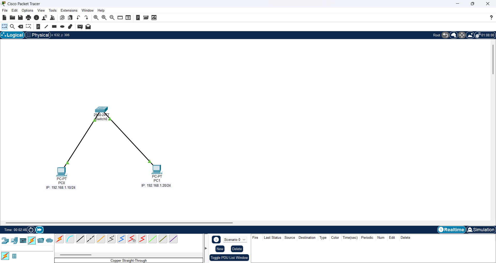
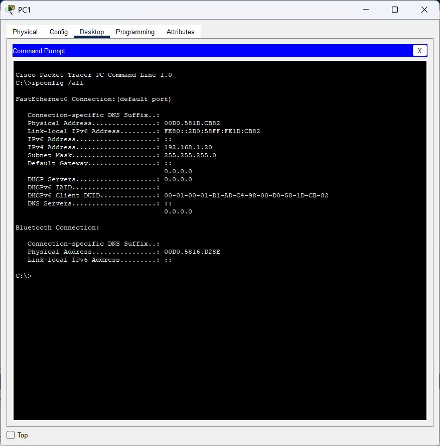
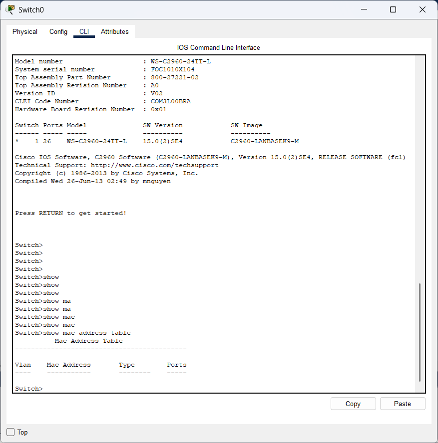
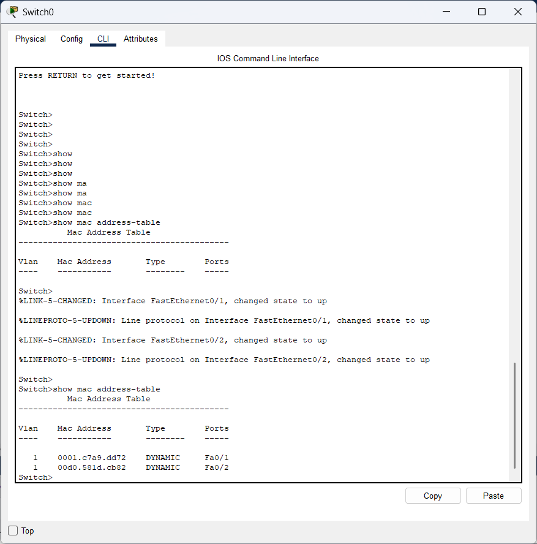
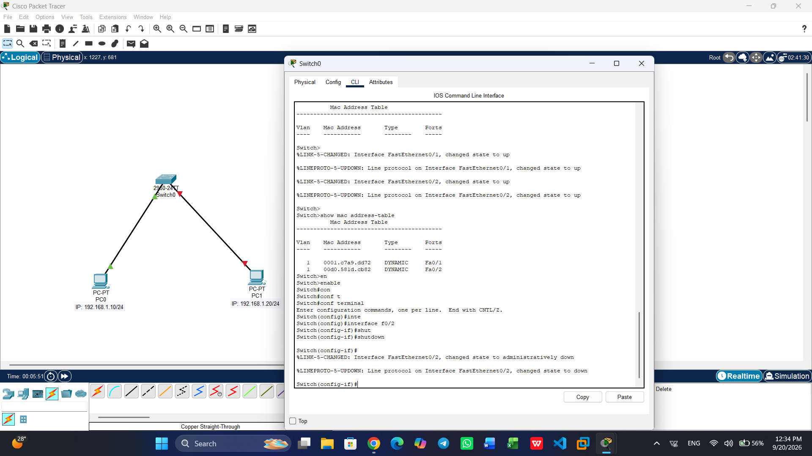
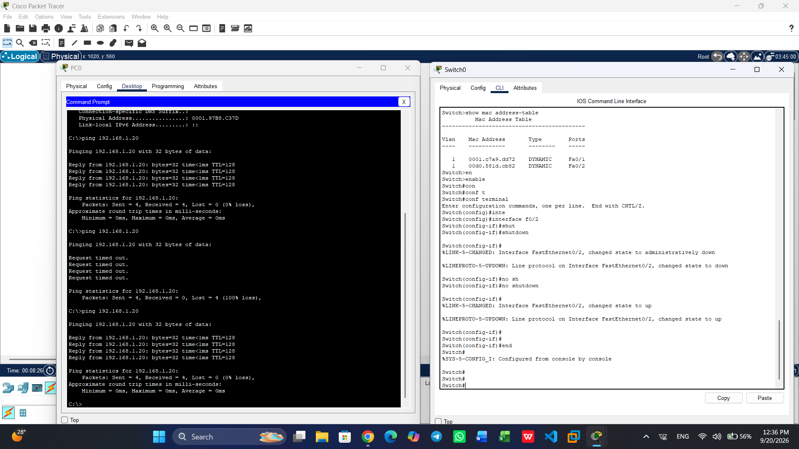

# LAB 01 — MAC Address & Switch Learning

## 🎯 Objective

Understand how a Layer 2 switch learns MAC addresses, builds its MAC Address Table, and uses that information for Ethernet frame forwarding.

### Skills Practiced

- MAC Addresses
- Ethernet Frames
- Source MAC Learning
- Destination MAC Forwarding
- MAC Address Tables
- Dynamic MAC Learning
- Unknown Unicast Flooding
- ARP vs MAC Address Table
- Layer 2 Troubleshooting
- Switch Port Recovery

---

## 🧩 Topology

```text
PC0 ───────── SW1 ───────── PC1
```

### Initial Connections

```text
PC0 Fa0 → SW1 Fa0/1
PC1 Fa0 → SW1 Fa0/2
```

PC1 was later moved to:

```text
PC1 Fa0 → SW1 Fa0/3
```

---

## 🌐 Network Configuration

| Device | IP Address | Subnet Mask | Gateway |
|---|---|---|---|
| PC0 | 192.168.1.10 | 255.255.255.0 | None |
| PC1 | 192.168.1.20 | 255.255.255.0 | None |

Both hosts are on the same subnet, so no default gateway is required for communication between them.

---

## 🔑 Device Addresses

| Device | IP Address | MAC Address | Initial Port |
|---|---|---|---|
| PC0 | 192.168.1.10 | `000B.BE7D.BC94` | Fa0/1 |
| PC1 | 192.168.1.20 | `0010.114E.72CC` | Fa0/2 |

After moving PC1:

```text
0010.114E.72CC → Fa0/3
```

---

# 📚 Core Concepts

## 1. MAC Address

A MAC address is a Layer 2 address associated with a network interface and used by Ethernet for local network communication.

```text
MAC → Layer 2
IP  → Layer 3
```

---

## 2. Ethernet Frame

An Ethernet frame contains Layer 2 addressing information including:

```text
Source MAC
Destination MAC
Data
```

Example:

```text
Source MAC      = 000B.BE7D.BC94
Destination MAC = 0010.114E.72CC
```

---

## 3. MAC Address Table

A switch maintains a MAC Address Table that maps:

```text
MAC Address → Switch Port
```

Example:

```text
000B.BE7D.BC94 → Fa0/1
0010.114E.72CC → Fa0/2
```

---

## 4. MAC Address Learning

A switch learns from the **Source MAC Address** of an incoming Ethernet frame.

Example:

```text
Source MAC    = 000B.BE7D.BC94
Incoming Port = Fa0/1
```

The switch learns:

```text
000B.BE7D.BC94 → Fa0/1
```

### Key Rule

> A switch learns the Source MAC address from an incoming frame and associates it with the incoming port.

---

## 5. Forwarding

When a frame arrives, the switch:

```text
Incoming Frame
      ↓
Learn Source MAC
      ↓
Check Destination MAC
      ↓
MAC Address Table Lookup
      ↓
Forward to the correct port
```

If the destination MAC is known:

```text
Destination MAC → Specific Port → Forward
```

If the destination MAC is unknown:

```text
Unknown Unicast → Flood
```

---

## 6. ARP Table vs MAC Address Table

### ARP Table

Maintained by the host:

```text
IP Address → MAC Address
```

Command:

```cmd
arp -a
```

### MAC Address Table

Maintained by the switch:

```text
MAC Address → Switch Port
```

Command:

```cisco
show mac address-table
```

---

# 🧪 Lab Experiments

## Experiment 1 — Initial MAC Table

Before generating the main traffic, the switch MAC Address Table was checked:

```cisco
show mac address-table
```

The PCs' dynamic MAC entries were not yet present.

---

## Experiment 2 — MAC Learning

Traffic was generated from PC0:

```cmd
ping 192.168.1.20
```

After the traffic, the switch learned:

```text
000B.BE7D.BC94 → Fa0/1
0010.114E.72CC → Fa0/2
```

The entries appeared as dynamic MAC entries.

### Result

The switch successfully learned the location of both hosts.

---

## Experiment 3 — MAC Table Reset and Relearning

Dynamic entries were cleared:

```cisco
clear mac-address-table dynamic
```

After generating traffic again, the switch learned the MAC addresses automatically.

### Result

MAC learning is dynamic and can be rebuilt from network traffic.

---

## Experiment 4 — MAC Relocation

PC1 was moved:

```text
Fa0/2 → Fa0/3
```

PC1 then generated traffic.

The switch learned the new location:

```text
0010.114E.72CC → Fa0/3
```

### Result

The MAC Address Table reflects the port from which traffic is received.

---

# 🚨 Intentional Failure

The switch port connected to PC1 was intentionally disabled:

```cisco
enable
configure terminal
interface fa0/3
shutdown
end
```

PC0 then attempted:

```cmd
ping 192.168.1.20
```

The connectivity test failed.

---

# 🔍 Troubleshooting

The switch port status was checked:

```cisco
show interfaces status
```

Then the interface was inspected in detail:

```cisco
show interfaces fa0/3
```

The result showed:

```text
Fa0/3
Administratively Down
```

### Root Cause

The interface had been administratively disabled using:

```cisco
shutdown
```

The issue was therefore a Layer 2 interface-state problem rather than an IP or subnet configuration problem.

---

# 🔧 Fix

The interface was restored:

```cisco
enable
configure terminal
interface fa0/3
no shutdown
end
```

---

# ✅ Verification

After restoring the interface:

```cmd
ping 192.168.1.20
```

Connectivity was successfully restored.

Final interface state:

```text
Fa0/1 → connected
Fa0/3 → connected
```

Final MAC learning:

```text
000B.BE7D.BC94 → Fa0/1
0010.114E.72CC → Fa0/3
```

---

# 🛠️ Commands Used

## PC

```cmd
ipconfig /all
ping 192.168.1.20
arp -a
```

## Switch

```cisco
enable
show mac address-table
show mac address-table dynamic
show interfaces status
show interfaces fa0/3

configure terminal
interface fa0/3
shutdown
no shutdown
end

clear mac-address-table dynamic
```

---

# 📸 Evidence

### Topology



### PC0 MAC Address


### PC1 MAC Address



### MAC Table Before Traffic



### MAC Table After Traffic



### Intentional Failure



### Final Interface Status



---

# 🧠 Key Takeaways

```text
Source MAC
    ↓
MAC Learning
    ↓
MAC Address Table
    ↓
Destination MAC Lookup
    ↓
Layer 2 Forwarding
```

### Core Rules

1. A switch learns from the **Source MAC**.
2. A switch uses the **Destination MAC** for forwarding.
3. MAC Address Table = **MAC → Port**.
4. ARP Table = **IP → MAC**.
5. Known destination = forward to the correct port.
6. Unknown unicast = flood within the relevant Layer 2 domain.
7. MAC learning is dynamic.
8. A switch port can be administratively disabled and later restored.

---

# 📁 Lab Files

```text
LAB-01-MAC-Address-Switch-Learning/
│
├── LAB-01-MAC-Address-Switch-Learning.pkt
├── README.md
└── screenshots/
```

---

## ✅ Status

**Completed**

**100-Day IT Infrastructure Journey — Day 1**
